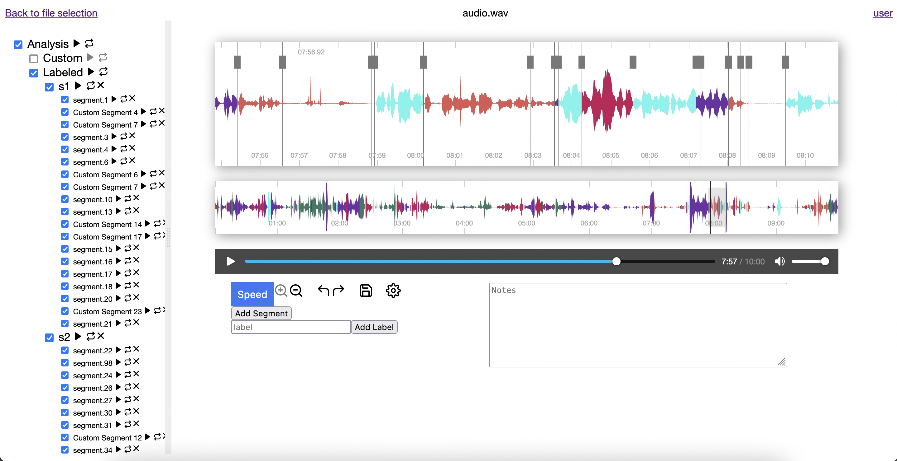

<div align="center">
    <center>
        <h1>
            Speechviz
        </h1>
        <h3>
            An annotation tool for analyzing real-world auditory soundscapes
        </h3>
        
    </center>
</div>

<br>

# Speechviz

Speechviz is a tool to

1. Automatically process audio and video data—performing speaker diarization,
   voice-activity detection, speech recognition, and face detection
2. Visualize the generated annotations in a user-friendly interface that allows
   playing the audio segments and refining the generated annotations to correct
   any errors

## Contents

- [Speechviz](#speechviz)
  - [Contents](#contents)
  - [pyannote access](#pyannote-access)
  - [Docker / Podman image](#docker--podman-image)
  - [Manual installation](#manual-installation)
    - [Setup the interface](#setup-the-interface)
    - [Install script dependencies](#install-script-dependencies)
      - [pip](#pip)
      - [conda](#conda)
  - [Usage](#usage)
  - [Troubleshooting](#troubleshooting)

## pyannote access

Before you can get started, you'll have to get an access token
to use pyannote. You can do so by following these steps:

1. Login to or signup for https://huggingface.co/
2. Visit each of the following and accept the user conditions:
   - https://huggingface.co/pyannote/segmentation
   - https://huggingface.co/pyannote/speaker-diarization
   - https://huggingface.co/pyannote/voice-activity-detection
3. Go to https://huggingface.co/settings/tokens and create an access token
4. Set your `PYANNOTE_AUTH_TOKEN` environment variable to your access token

## Docker / Podman image

The image is built from the
[Aria Data Tools](https://github.com/facebookresearch/Aria_data_tools/)
image, so you'll need to build that container first.

```bash
git clone https://github.com/facebookresearch/Aria_data_tools.git --recursive
cd Aria_data_tools
docker build -t aria_data_tools .
```

After that's finished, build the Speechviz container.

```bash
git clone https://research-git.uiowa.edu/uiowa-audiology-reu-2022/speechviz.git
cd speechviz
docker build --build-arg \
    PYANNOTE_AUTH_TOKEN="${PYANNOTE_AUTH_TOKEN}" \
    -t speechviz .
```

Note that the above commands build the image with PyTorch CPU support only.
If you'd like to include support for CUDA, follow the instructions for using the
[NVIDIA Container Toolkit](https://docs.nvidia.com/datacenter/cloud-native/container-toolkit/overview.html)
and add `--build-arg cuda=true` to the `docker build` command above:

```bash
docker build --build-arg \
    PYANNOTE_AUTH_TOKEN="${PYANNOTE_AUTH_TOKEN}" \
    --build-arg cuda=true -t speechviz .
```

You'll want to mount your data into the image. To create the data folder, repository,
and database, run these 3 commands:

```bash
npm run mkdir
python3 scripts/init_fossil.py
```

You can then start the container by running

```bash
docker run -it \
    -v ./data:/speechviz/data \
    -v ./speechviz.sqlite3:/speechviz/speechviz.sqlite3 \
    speechviz
```

If you're going to use the interface in the container, use the `-p PORT:PORT` option.
By default, the interface uses port 3000, so the command for that port is

```bash
docker run -it -p 3000:3000 \
    -v ./data:/speechviz/data \
    -v ./speechviz.sqlite3:/speechviz/speechviz.sqlite3 \
    speechviz
```

## Manual installation

```bash
git clone https://research-git.uiowa.edu/uiowa-audiology-reu-2022/speechviz.git
cd speechviz
```

### Setup the interface

```bash
npm install
npm run mkdir
python3 scripts/init_fossil.py
```

### Install script dependencies

To use `process_audio.py`, you will need to install
[audiowaveform](https://github.com/bbc/audiowaveform)
and [ffmpeg](https://ffmpeg.org/). The remaining dependencies for `process_audio.py`
can be installed using `pip` or `conda`.
For `encode_faces.py` and `cluster_faces.py`, you will need to install
[dlib](USAGE.md#face-detection-and-clustering).
If you'll be using `extract-vrs-data.py`, you will need to install
[VRS](https://github.com/facebookresearch/vrs).
Lastly, for `create_poses.py`, you will need to install
[Aria Data Tools](https://github.com/facebookresearch/Aria_data_tools/).

#### pip

To install with PyTorch CPU support only:

```bash
pip3 install --extra-index-url \
    "https://download.pytorch.org/whl/cpu" \
    -r requirements.txt
```

To install with PyTorch CUDA support (Linux and Windows only):

```bash
pip3 install --extra-index-url \
    "https://download.pytorch.org/whl/cu116" \
    -r requirements.txt cuda-python nvidia-cudnn
```

#### conda

```bash
conda env create -f environment.yml
```

## Usage

Audio can be processed by moving the audio file to `data/audio`
(or `data/video` for video files) and running

```bash
python3 scripts/process_audio.py data/audio/FILE
```

Then, to view the results on the interface, run

```bash
npm start
```

and open http://localhost:3000.  
For a more in-depth usage guide, see [USAGE.md](USAGE.md).

## Troubleshooting

[comment]: # "ERROR: Could not install packages due to an OSError: Proxy URL had no scheme, should start with http:// or https://"

If installing on Bigcore, you are likely to run into an error relating to a proxy URL.
To resolve this, run the following command:

```bash
http_proxy="http://$(echo $http_proxy)" && https_proxy="http://$(echo $https_proxy)"
```

[comment]: # "subprocess.CalledProcessError: Command '['ffmpeg', ... 'output_file_here']' returned non-zero exit status 127."

If you receive a `subprocess.CalledProcessError` relating to `ffmpeg`, running the
following should resolve the issue:

```bash
conda update ffmpeg
```

If installing for the first time on a fresh wsl and you get this error `/usr/bin/env: ‘bash\r’: No such file or directory` the problem is likely you don't have nodejs. This should fix it:

```bash
export PATH=/usr/local/sbin:/usr/local/bin:/usr/sbin:/usr/bin:/sbin:/bin
sudo apt install nodejs npm
```
